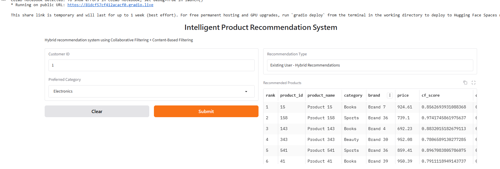
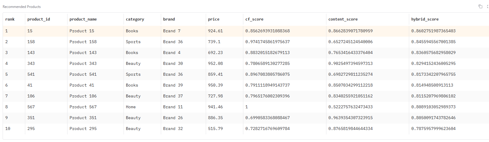
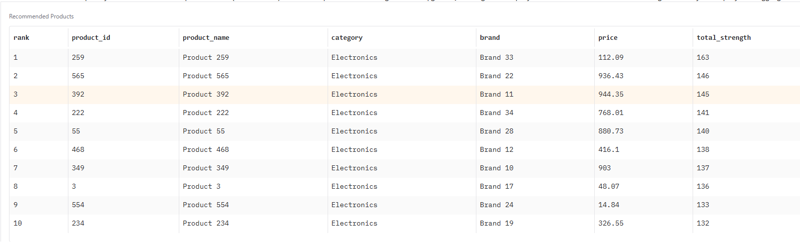
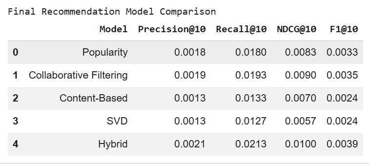

# Intelligent Product Recommendation System

An AI-powered product recommendation system that combines
Collaborative Filtering and Content-Based Filtering to generate
personalized Top-N product recommendations.

## 1. Project Overview

The system recommends products based on customer interaction
history and product characteristics.

It supports both existing users and new users through a
cold-start recommendation strategy.

## 2. Problem Statement

E-commerce platforms need to recommend relevant products to users
based on their previous interactions and product characteristics.

This project builds a recommendation system that uses multiple
recommendation techniques and combines them using a hybrid approach.

## 3. Dataset

The project uses a synthetic e-commerce dataset containing:

- 1,500 customers
- 600 products
- 30,000 interactions

Main datasets:

- customers.csv
- products.csv
- interactions.csv

The pre-generated recommendations.csv file was not used for
building the recommendation models.

## 4. Data Preprocessing

The following preprocessing steps were performed:

- Checked missing values
- Checked duplicate records
- Validated customer and product IDs
- Converted interaction dates into datetime format
- Created interaction-strength scores

Interaction weights:

- View = 1
- Click = 2
- Wishlist = 3
- Cart = 4
- Purchase = 5

## 5. Recommendation Approaches

### Popularity Baseline

Products were ranked according to their total interaction strength.
This provides a baseline for comparing recommendation models.

### Collaborative Filtering

Item-based Collaborative Filtering was implemented using
user-product interaction data and cosine similarity.

### Content-Based Filtering

Product characteristics such as category, brand, and price were
converted into numerical features.

Cosine similarity was then used to identify similar products.

### SVD

SVD-based matrix factorization was implemented as an additional
Collaborative Filtering approach.

### Hybrid Recommendation

Collaborative Filtering and Content-Based Filtering were combined
using a weighted scoring approach.

Final Score:

Hybrid Score = 0.6 × Collaborative Score + 0.4 × Content Score

The scores were normalized before combining them.

## 6. Cold Start Handling

For new users with no interaction history, the system uses the
user's preferred product category and product popularity to generate
recommendations.

Example:

New user + Electronics preference → popular Electronics products.

## 7. Evaluation

The recommendation models were evaluated using a train/test strategy
where the latest interaction of each customer was held out as the
test interaction.

Evaluation metrics:

- Precision@10
- Recall@10
- F1@10
- NDCG@10

Models evaluated:

- Popularity Baseline
- Collaborative Filtering
- Content-Based Filtering
- SVD
- Hybrid Recommendation

## 8. API

FastAPI was used to provide recommendation endpoints.

### Existing User

GET:

/recommend/{customer_id}

Example:

/recommend/1?top_n=10

### Cold Start

GET:

/cold-start

Example:

/cold-start?preferred_category=Electronics&top_n=10

## 9. User Interface

A Gradio-based user interface was developed.

The UI supports:

- Existing customer recommendations
- New-user cold-start recommendations
- Product recommendation display

Architecture:

Gradio UI → FastAPI → Recommendation Model → FastAPI → Gradio UI

## 10. Testing

The FastAPI endpoints were tested using HTTP requests.

Existing-user recommendation:

Status Code: 200

Cold-start recommendation:

Status Code: 200

The Gradio UI was also tested for existing users and new users.

## 11. Technologies Used

- Python
- Pandas
- NumPy
- Scikit-learn
- SciPy
- Scikit-Surprise
- FastAPI
- Uvicorn
- Gradio

## 12. Project Status

The recommendation models, evaluation, cold-start handling,
FastAPI backend, and Gradio user interface have been implemented
and tested.

## 14. Evaluation Results

The models were evaluated using Precision@10, Recall@10 and NDCG@10.

| Model | Precision@10 | Recall@10 | NDCG@10 |
|---|---:|---:|---:|
| Popularity Baseline | 0.0018 | 0.0180 | 0.0083 |
| Collaborative Filtering | 0.0019 | 0.0193 | 0.0090 |
| Content-Based Filtering | 0.0013 | 0.0133 | 0.0070 |
| SVD | 0.0013 | 0.0127 | 0.0057 |
| Hybrid Recommendation | 0.0021 | 0.0213 | 0.0100 |

The evaluation used 1,500 customers with one held-out interaction
per customer as the test target.

The Hybrid model combines Collaborative Filtering and
Content-Based Filtering using a 0.6 / 0.4 weighting strategy.

## 15. System Architecture

The system follows a simple client-server recommendation architecture.

### Recommendation Flow

1. The user enters a Customer ID or preferred category in the Gradio UI.
2. Gradio sends an HTTP request to the FastAPI backend.
3. FastAPI calls the appropriate recommendation function.
4. The recommendation system generates product recommendations.
5. For existing users, the Hybrid model combines Collaborative Filtering
   and Content-Based Filtering.
6. For new users, the Cold Start strategy uses the preferred category
   and product popularity.
7. FastAPI returns the recommendations as a JSON response.
8. Gradio displays the recommended products to the user.

### Architecture

Gradio UI
    ↓
FastAPI Backend
    ↓
Recommendation Model
    ↓
Hybrid Recommendation / Cold Start
    ↓
FastAPI JSON Response
    ↓
Gradio UI

## 16. Screenshots

### Hybrid Recommendation UI

### Hybrid Recommendation Results

### Cold Start Recommendation

### Evaluation Results

## 17. Project Structure

intelligent-product-recommendation/
|
|-- data/
|   |-- customers.csv
|   |-- products.csv
|   |-- interactions.csv
|
|-- notebooks/
|   |-- recommendation_system.ipynb
|
|-- src/
|   |-- preprocessing.py
|   |-- recommendation.py
|   |-- evaluation.py
|   |-- api.py
|
|-- app/
|   |-- ui.py
|
|-- screenshots/
|   |-- hybrid_recommendations_ui.png
|   |-- hybrid_recommendation_results.png
|   |-- cold_start_ui.png
|   |-- evaluation_results.png
|
|-- requirements.txt
|-- README.md
|-- .gitignore

## 18. Installation

Clone the repository:

git clone <your-github-repository-url>

Install the required dependencies:

pip install -r requirements.txt

## 19. How to Run

### Step 1: Start the FastAPI Backend

Run the FastAPI application:

uvicorn src.api:app --host 0.0.0.0 --port 8000

### Step 2: Start the Gradio UI

Run the Gradio application:

python app/ui.py

### Step 3: Use the Application

For an existing user:

1. Enter a valid Customer ID.
2. Click Submit.
3. The system sends a request to the FastAPI backend.
4. The Hybrid Recommendation model generates Top-N recommendations.
5. The recommendations are displayed in the Gradio UI.

For a new user:

1. Leave Customer ID empty.
2. Select a preferred category.
3. Click Submit.
4. The Cold Start recommendation strategy generates popular products
   from the selected category.
5. The recommendations are displayed in the Gradio UI.

## 20. Limitations

- The dataset is a synthetic e-commerce dataset.
- The current evaluation uses one held-out interaction per customer.
- The recommendation quality depends on the available interaction history.
- New users without a preferred category have limited personalization.
- The current system is demonstrated locally using Google Colab.
- The API and UI are not deployed to a production cloud environment.

## 21. Future Improvements

- Deploy FastAPI and Gradio to a cloud platform.
- Use a larger real-world e-commerce dataset.
- Add recommendation diversity and novelty.
- Add more user and contextual features.
- Optimize hybrid weights using a separate validation set.
- Explore advanced recommendation and ranking techniques.
- Add user authentication and persistent user profiles.